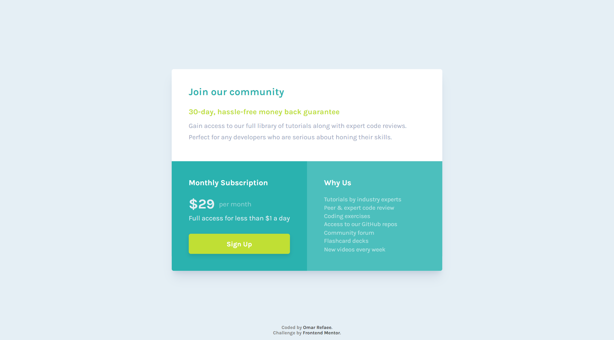

# Frontend Mentor - Single price grid component solution

This is a solution to the [Single price grid component challenge on Frontend Mentor](https://www.frontendmentor.io/challenges/single-price-grid-component-5ce41129d0ff452fec5abbbc).

## Table of contents

-   [Overview](#overview)
    -   [The challenge](#the-challenge)
    -   [Screenshot](#screenshot)
    -   [Links](#links)
-   [My process](#my-process)
    -   [Built with](#built-with)
-   [Author](#author)

## Overview

### The challenge

Users should be able to:

-   View the optimal layout for the component depending on their device's screen size
-   See a hover state on desktop for the Sign Up call-to-action

### Screenshot

### Links

-   Solution URL: [Solution URL](https://www.frontendmentor.io/solutions/responsive-single-price-grid-html-scss-b7xl64djTt)
-   Live Site URL: [Live Site URL](https://single-price-grid-challenge.netlify.app/)

## My process

### Built with

-   Semantic HTML5 markup
-   CSS3
-   Flexbox
-   CSS Grid
-   Mobile-first workflow
-   [SCSS](https://sass-lang.com/) - CSS Preprocessor

## Author

-   Website - [Omar Refaee](https://www.github.com/OmarRefaee)
-   Frontend Mentor - [@OmarRefaee](https://www.frontendmentor.io/profile/OmarRefaee)
-   Facebook - [@OmarRefaee0](https://www.facebook.com/OmarRefaee0)
